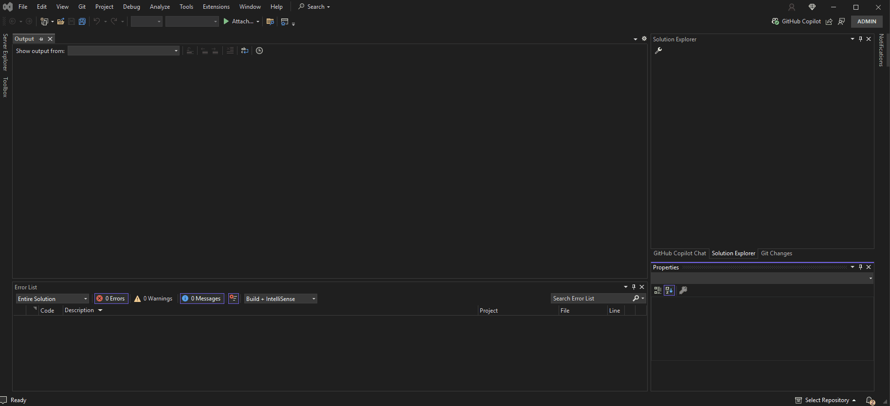

# 🛠 Custom T4 Template Setup for Devart EF Core with DevExpress XAF

## ✅ Requirements

Before you start, make sure you have the following installed:

- **DevExpress XAF** (eXpressApp Framework)
  - [DevExpress XAF](https://www.devexpress.com/products/net/application_framework/)

- **Devart Entity Developer (Edition for Entity Framework) (7.3.235)**
  - [Devart Entity Developer](https://www.devart.com/entitydeveloper/entity-framework-core-designer.html)

---

## 📁 Template Location

There are two files:
- `.tmpl` (T4 template file)
- `.xml` (metadata)

Copy the two files into the folder located at:

```
C:\Program Files (x86)\Common Files\Devart\EntityDeveloper\Shared Templates
```


---

## 🔧 Step-by-Step Instructions

1. **Create an app using the XAF wizard.**

2. **Save, close, and reopen the project.**

3. **Delete the auto-generated `DbContext` file.**
   - Located in the `BusinessObjects` folder of the module created by the wizard.

4. **Create a new Devart EF Core model file.**
   - In the same `BusinessObjects` folder or other folder:
     - Right-click > Add > New Item
     - Choose: `Data` or `ASP.NET Core > Data`
     - Select: **Devart EF Core Model**

5. **Select "Database First" approach.**

6. **Configure the SQL Server connection.**
   - Choose server and database.
   - In **Advanced**, set the following:
     ```
     MultipleActiveResultSets=True
     Encrypt=True
     TrustServerCertificate=True
     ```

7. **Generate model from database.**
   - Select the desired tables.

8. **Set pluralization options:**
  
9. **Configure context and namespace:**

10. **Add the custom template:**
    - Click the first "Add Template" button
    - From `Shared`, choose: **EF Core XAF**
    - Remove any other existing template

11. **Click "Finish" to complete the setup.**

---

## ✅ Result

Your Devart EF Core model will now generate code that’s fully compatible with DevExpress XAF using the customized T4 template.


## 📄 Demo



